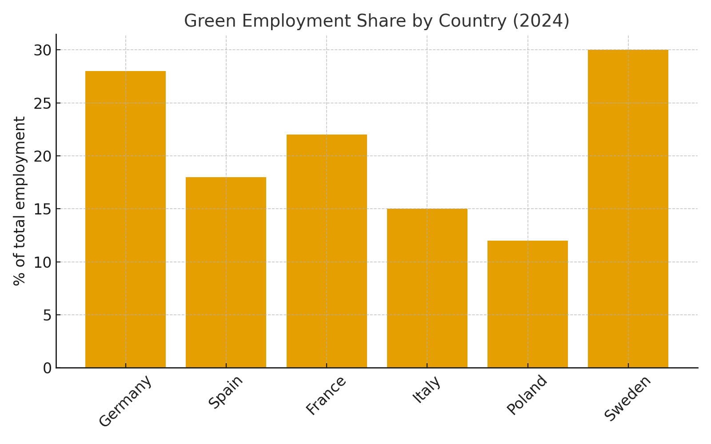
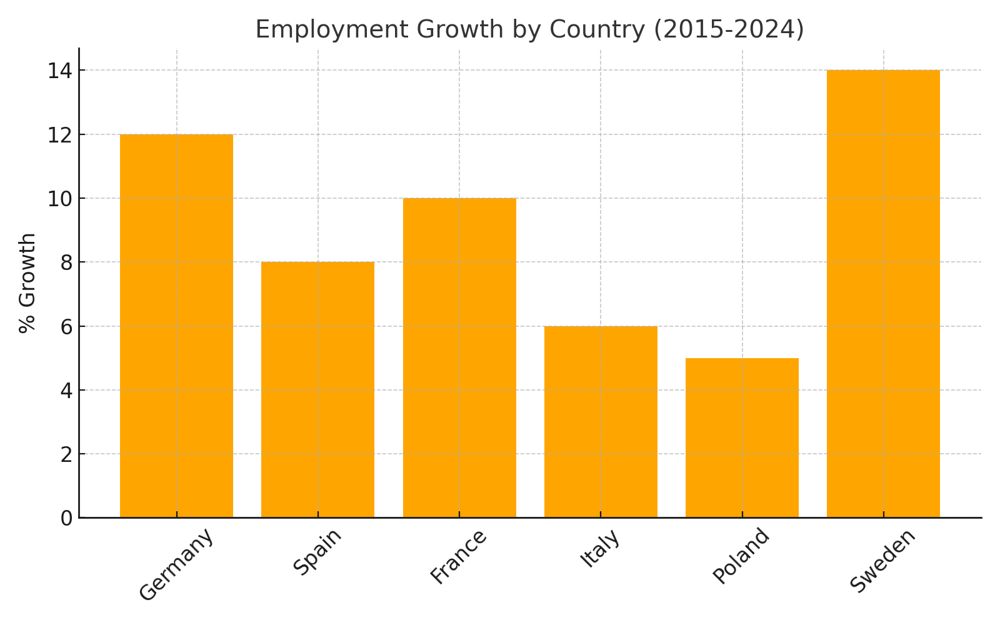

📌 Project Overview

This project analyses employment trends in Europe (2015–2024) with a focus on green jobs and education levels.
The goal is to demonstrate how SQL and Business Intelligence tools can be used to transform public datasets into policy-relevant insights.

🗂️ Data Sources

Eurostat employment by sector (NACE, 2015–2024)

Eurostat education and labour force data (ISCED levels)

Self-created mapping of green sectors (NACE → Green/Non-Green)

🛠️ Technologies

SQL (PostgreSQL/MySQL) for data storage and queries

Python (Pandas, Matplotlib) for additional preprocessing (optional)

Power BI for visualization and dashboards

📊 Key Analyses

Employment growth by sector (2015–2024)

Top 5 sectors with highest relative growth

Share of green jobs by country and year

Education gap: share of high-educated workers in employment

Ranking of countries by green employment share (2024)

📈 Dashboards

## 📈 Dashboards  

### Green Employment Share by Country (2024)  
  

### Employment Growth by Country (2015–2024)  
  

🚀 Results

Green employment shows strong growth in renewable energy and ICT sectors.

Northern and Central Europe lead in green jobs share (>25%), while Southern regions lag behind.

Countries with higher green employment also show higher shares of high-educated workers.

👩‍💻 Author

María José Sánchez Herrero

GitHub: mjsherrero# eu-green-employment-sql.
EU Green Employment Analysis (SQL + Power BI)
